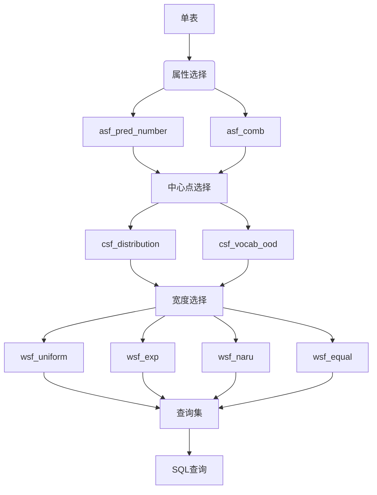

# Query-Builder
输入csv格式单表数据，产生包含"=,<=,>=,[]"的sql查询。

## 生成查询流程

1.从表中选择某些属性；


程序提供了两种方法选择某些属性：
|方法|实现方式|可选参数|
|---|---|---|
|asf_pred_number|在表中随机的选择n个不同的属性。可以通过输入参数(nums)限制最大选择数量，也可以通过输入属性黑名单(blacklist)或白名单(whitelist)来限制选择域。|whitelist：属性白名单      blacklist:属性黑名单     nums：最大属性选择数量|
|asf_comb|选择使用者输入的属性(comb)|comb:输入的属性列表|

2.为这些属性选择中心点；

|方法|实现方式|可选参数|
|---|---|---|
|csf_distribution|首先在表中随机选择1000行作为中心点的候选行。当属性需要中心点时，选择某一行对应属性的值作为其中心点。|data_from：从哪一行开始选择|
|csf_vocab_ood|为每个属性单独随机选择一个点作为中心点|-|

3.根据属性和中心点选择一个宽度。

|方法|实现方式|可选参数|
|---|---|---|
|wsf_uniform|从属性列的最大值和最小值之间概率均等的选择一个值作为宽度width,然后根据宽度选择<=,>=,=,[]作为相应谓词。Nan和Nat,以及null都只能选择"="作为谓词。|-|
|wsf_exponential|通过指数分布选择宽度值|-|
|wsf_naru|1.首先从"="">=""<="之间随机选择一个操作符2.选择对应属性的中心点作为操作数。若属性值的数量不超过10，则仅选择相等谓词。|-|
|wsf_equal|只选择相等谓词|-|


## 文件说明

|文件|作用|
|---|---|
|constants.py|数据目录相关的常量|
|dataset.py|数据集相关，包括对表，列的解析|
|dtype.py|对数据类型的解析|
|query.py|查询的表示|
|generator.py|在表上生成查询|
|main.py|生成sql查询集|





## 如何使用

data目录下存放要读取的单表数据，结果保存在output目录下。
```bash
python -m main [--s <seed>] [--d <dataset>]  [-q <query>] [--params <params>]
"""
Options:
  --s <seed>                Random seed.
  --d <dataset>             The input dataset [default: census].
  --q <query>               Name of the sqls [default: newquery].
  --n <number>              The number of queries to be generated[default: 10000].
  --params <params>         Parameters that are needed.
"""
```
其中，params是对三个步骤的的选择参数，其格式如下：
```bash
params:" {  'attr': {'pred_number': p1[, 'fun2': p2]}, \
            'center': {'distribution': p1[, 'fun2': p2]}, \
            'width': {'uniform': p1[, 'fun2': p2]},\
            'attr_params': {['param':]},\
            'center_params':{['param':]}\
            'width_params':{['param':]}\
            } "
```
其中'attr''center''width'分别时生成查询的三个步骤，其后的Dict代表的是{生成方式：采用该方式的概率}。比如，选择pred_number以1.0的概率选择属性，可以将参数设置为： 'attr': {'pred_number': 1.0}。
'attr_params''center_params''width_params'是三个步骤特定的参数，对应上面表格内容。

- 例如，对cencus数据集生成10000个查询，并将查询文件命名为queries.sql,可以执行下面的命令：
```bash
python -m main --d census --q queries --n 10000 
```
- 也可以对生成方式进行选择，这需要调整参数param一些内容。例如，随机在census表的'age','workclass'属性中选择属性，并且使用distribution，vocab_ood方法生成数据中心，采用如下命令：
```bash
  python -m main --params "{'attr': {'pred_number': 1.0}, \
                        'center': {'distribution': 0.9, 'vocab_ood': 0.1}, \
                        'width': {'uniform': 0.5, 'exponential': 0.5}\
                        'attr_params':{'whitelist':['age','workclass']},\
                        }"
```
